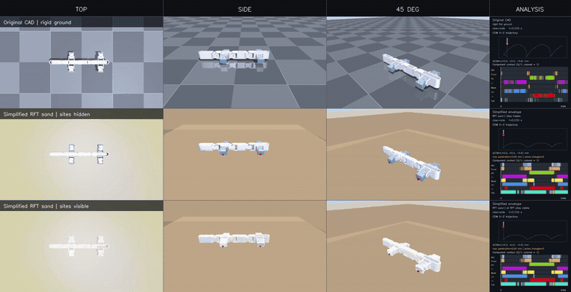

# Lizard Robot V1 — MuJoCo rigid floor + granular RFT

Reproducible lizard-robot locomotion with:

- the original detailed CAD model on a rigid flat floor;
- a topology-gated simplified model on granular media using triangle-level
  3D resistive-force theory (RFT);
- synchronized top, side, and 45-degree videos;
- center-of-mass, penetration, active-triangle, and component-contact
  diagnostics;
- one Conda environment that deploys the complete project on a fresh system.

MuJoCo is installed by `environment.yml`. No separate MuJoCo download or
system-wide installation is required. IsaacLab is unrelated and is not used.

## See the result first

Click the animated preview to open the full 6 s / 30 FPS master MP4:

[](docs/media/video_matrix_production_6s/video_matrix_overview.mp4)

The master layout is three scenario rows ×
`Top | Side | 45° | Analysis`. Its first three columns are the nine pure camera
views; the last column contains exactly one COM/contact/penetration panel per
scenario.

### Checked-in production videos

| Scenario | Top | Side | 45-degree |
| --- | --- | --- | --- |
| Original CAD, rigid ground | [MP4](docs/media/video_matrix_production_6s/rigid_original/top.mp4) | [MP4](docs/media/video_matrix_production_6s/rigid_original/side.mp4) | [MP4](docs/media/video_matrix_production_6s/rigid_original/diag45.mp4) |
| Simplified RFT, sites hidden | [MP4](docs/media/video_matrix_production_6s/sand_simplified/top.mp4) | [MP4](docs/media/video_matrix_production_6s/sand_simplified/side.mp4) | [MP4](docs/media/video_matrix_production_6s/sand_simplified/diag45.mp4) |
| Simplified RFT, sites visible | [MP4](docs/media/video_matrix_production_6s/sand_simplified_sites/top.mp4) | [MP4](docs/media/video_matrix_production_6s/sand_simplified_sites/side.mp4) | [MP4](docs/media/video_matrix_production_6s/sand_simplified_sites/diag45.mp4) |

- [Master 3×3 + three-panel MP4](docs/media/video_matrix_production_6s/video_matrix_overview.mp4)
- [All checked-in videos and SHA-256 values](docs/media/video_matrix_production_6s/README.md)
- [Production numerical results and manifest](docs/regressions/2026-07-27-video-matrix-production-6s/MANIFEST.md)

### Why the older meshes were rejected

[](docs/media/failed_mesh_diagnostics/README.md)

Three short geometry-only comparisons show the former raw CAD assembly,
legacy vertex-clustering remesh, and direct fixed-count Fusion triangulation
beside the accepted active surface. They make clustered/uneven RFT centroid
sites, overlapping components, slivers, and self-intersections directly
visible. These are diagnostic comparisons, not locomotion results.

- [Open all three failed-mesh comparison videos](docs/media/failed_mesh_diagnostics/README.md)
- [Read the metrics, causes, and reproduction guide](docs/FAILED_MESH_DIAGNOSTICS.md)

## Deploy on a fresh computer

### Prerequisites

Install:

1. [Git](https://git-scm.com/downloads);
2. [Miniforge](https://github.com/conda-forge/miniforge), Anaconda, or another
   working Conda distribution.

Miniforge is the recommended lightweight option. On Windows, use a
Miniforge/Anaconda PowerShell after installation. On Linux/macOS, initialize
Conda for the current shell if `conda` is not found.

### Windows PowerShell

```powershell
git clone --recurse-submodules https://github.com/wxy108/Lizard_robot.git
cd Lizard_robot
powershell -ExecutionPolicy Bypass -File scripts\setup.ps1
conda activate lizard_rft
```

### Linux, macOS, or WSL

```bash
git clone --recurse-submodules https://github.com/wxy108/Lizard_robot.git
cd Lizard_robot
bash scripts/setup.sh
conda activate lizard_rft
```

The setup scripts:

1. initialize the pinned `third_party/RFT-SiM` submodule;
2. create `lizard_rft` from `environment.yml`, or reuse it if it exists;
3. verify MuJoCo, NumPy, Open3D, PyMeshLab, OpenCV, and video support;
4. run the project validator.

To synchronize an existing environment:

```powershell
powershell -ExecutionPolicy Bypass -File scripts\setup.ps1 -Update
```

```bash
bash scripts/setup.sh --update
```

### Manual Conda installation

If scripts cannot be used:

```bash
git submodule update --init --recursive
conda env create --file environment.yml
conda activate lizard_rft
python scripts/validate_project.py
```

Expected validation:

- 13/13 fast tests pass;
- eight active RFT meshes pass topology/self-intersection gates;
- 13,916 force sites match 13,916 active triangles;
- rigid-floor and granular-RFT smoke runs complete;
- sand is at z = 0 and the emergency floor is at z = -0.25 m.

See [GUIDANCE.md](GUIDANCE.md) for headless Linux, macOS viewer commands,
troubleshooting, output interpretation, and clean-room reproduction.

## Run the simulations

Activate the environment and enter the cloned repository before every command:

```bash
conda activate lizard_rft
cd Lizard_robot
```

Original detailed model on rigid ground:

```bash
python run.py
```

Simplified model on RFT sand:

```bash
python lizard_sand.py --view --duration 10
```

Show all 13,916 RFT triangle sites:

```bash
python lizard_sand.py --view --duration 10 --show-force-sites all
```

Show one component:

```bash
python lizard_sand.py --view --duration 10 --show-force-sites FR
```

Valid component names:

```text
Mid Front FR FL Back HR HL Tail
```

Headless RFT run:

```bash
python lizard_sand.py --duration 10
```

This writes `results.npz`, `summary.json`, and the resolved config under an
ignored timestamped `outputs/sand/` directory.

On macOS, interactive MuJoCo passive-viewer commands may require `mjpython`
instead of `python`. Headless commands continue to use normal Python.

## Regenerate all videos

Production command:

```bash
python scripts/generate_video_matrix.py --duration 6 --fps 30
```

The command simulates rigid ground once and RFT sand once, replays the same
states from three cameras, and writes:

- nine individual MP4 files;
- `video_matrix_overview.mp4`;
- raw rigid/RFT NPZ arrays;
- COM, contact, penetration, and contact-event CSV files;
- static contact diagrams;
- the resolved gait config;
- `matrix_manifest.json` with source commit, dirty state, sizes, and hashes.

Analyze and verify a generated run:

```bash
python scripts/analyze_video_matrix.py outputs/video_matrix/run_...
```

Compose a master overview for an older compatible nine-video run:

```bash
python scripts/compose_video_matrix.py outputs/video_matrix/run_...
```

The generator refuses to overwrite an existing output directory.

Generate the three rejected/source-only mesh comparisons:

```bash
python scripts/generate_failed_mesh_videos.py
```

This generator audits and visualizes geometry only. It never runs the rejected
meshes through RFT physics. See
[docs/FAILED_MESH_DIAGNOSTICS.md](docs/FAILED_MESH_DIAGNOSTICS.md).

## Environment

The canonical [environment.yml](environment.yml) pins:

| Dependency | Version | Purpose |
| --- | --- | --- |
| Python | 3.11 | runtime |
| MuJoCo | 3.9.0 | simulation and rendering |
| NumPy | 1.26.4 | state and vectorized RFT arrays |
| SciPy | 1.17.1 | rotations and spatial queries |
| Open3D | 0.19.0 | active mesh loading/auditing |
| PyMeshLab | 2025.7.post1 | deterministic mesh reconstruction |
| OpenCV | 4.11.0.86 | dashboards and video composition |
| imageio / imageio-ffmpeg | 2.37.4 / 0.6.0 | H.264 MP4 writing |
| Matplotlib | 3.11.1 | analysis plots |
| Optuna | 4.9.0 | optional gait studies |

The `mujoco` Python wheel includes the MuJoCo native library. Do not install a
second standalone MuJoCo copy for this project.

## Current validated baseline

- Eight active RFT meshes are closed, single-component, consistently oriented,
  positive-volume, and have zero detected self-intersections.
- `Lizard_Sand.xml` contains 13,916 sequential force sites, exactly one per
  active mesh triangle.
- Force sites are visual group 5, hidden by default, and can be shown for one
  component or all components.
- World axes are +X forward, +Y left, +Z up.
- The RFT surface is z = 0; the rigid plane at z = -0.25 m is an emergency
  catch floor.
- The upstream RFT function returns body-on-sand force; the integration applies
  the equal-and-opposite reaction to the robot before `mj_step`.
- 13/13 tests, rigid smoke, RFT smoke, video generation, overview composition,
  and production artifact verification pass.

The model is a stable numerical baseline, not an experimentally calibrated
force model. The Fusion external envelope still requires semantic comparison
with authoritative CAD, and `RFTCOEFF=3.75` must be calibrated for the actual
granular material.

## Repository map

```text
.
|-- README.md                         # overview and quick deployment
|-- GUIDANCE.md                       # complete fresh-system handbook
|-- environment.yml                  # canonical cross-system Conda spec
|-- run.py                            # original rigid-floor runner
|-- lizard_sand.py                    # granular RFT runner
|-- sim_fxn_lib.py                    # vectorized 3D RFT calculations
|-- Lizard_Sand.xml                   # RFT scene and force sites
|-- asset/                            # active topology-gated RFT surfaces
|-- models/                           # rigid model and mesh sources
|-- configs/                          # gait and mesh recipe
|-- controllers/                      # deterministic CPG controller
|-- scripts/
|   |-- setup.ps1                     # Windows deployment
|   |-- setup.sh                      # Linux/macOS/WSL deployment
|   |-- validate_project.py           # canonical validation
|   |-- generate_video_matrix.py      # 9 videos + master
|   |-- generate_failed_mesh_videos.py # rejected/source mesh diagnostics
|   |-- compose_video_matrix.py       # master compositor
|   `-- analyze_video_matrix.py       # hash verification and metrics
|-- tests/                            # physics and reporting tests
|-- reference/rejected_meshes/        # diagnostic evidence; never active
|-- docs/
|   |-- media/                        # checked-in, directly viewable outputs
|   |-- regressions/                  # manifests and numerical evidence
|   `-- ...                           # status, decisions, provenance, guides
|-- third_party/RFT-SiM/              # pinned upstream submodule
`-- outputs/                          # reproducible local raw runs; ignored
```

## Documentation

Read in this order:

1. [GUIDANCE.md](GUIDANCE.md)
2. [Video matrix guide](docs/VIDEO_MATRIX_GUIDE.md)
3. [Failed-mesh diagnostic guide](docs/FAILED_MESH_DIAGNOSTICS.md)
4. [Results analysis guide](docs/RESULTS_ANALYSIS_GUIDE.md)
5. [Test and validation guide](docs/TEST_AND_VALIDATION_GUIDE.md)
6. [Implementation record](docs/IMPLEMENTATION_RECORD_2026-07-27.md)
7. [Project status](docs/PROJECT_STATUS.md)
8. [Decisions](docs/DECISIONS.md)
9. [Provenance](docs/PROVENANCE.md)

For mesh changes, read the mesh-rebuild and CAD caveats in `GUIDANCE.md`
before touching `asset/`.
