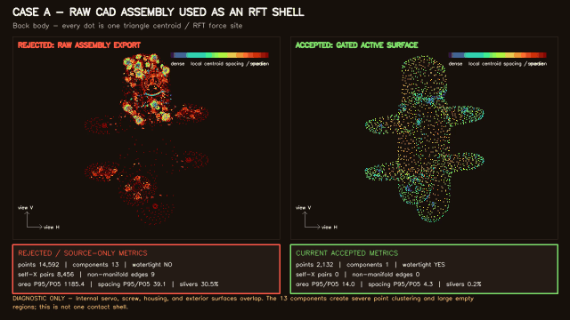

# Rejected RFT mesh diagnostics

These three short videos compare historically rejected or source-only meshes
against the current topology-gated active mesh for the same body.

[](01_raw_cad_assembly_vs_accepted.mp4)

Every colored dot is one triangle centroid. In the active RFT pipeline, that
centroid is one force application site. Blue/purple means locally dense;
orange/red means locally sparse relative to that mesh's median spacing.

## Videos

1. [Raw CAD assembly versus accepted Back](01_raw_cad_assembly_vs_accepted.mp4)
   — overlapping internal assembly surfaces, 13 components, 8,456
   self-intersecting pairs, and centroid-spacing P95/P05 = 39.12.
2. [Legacy vertex-clustering remesh versus accepted Back](02_legacy_vertex_cluster_vs_accepted.mp4)
   — triangle count was reduced, but 13 components, non-manifold topology,
   1,055 self-intersections, and uneven spacing remained.
3. [Direct fixed-count Fusion source versus accepted FR](03_fixed_count_fusion_vs_accepted.mp4)
   — the external envelope is a useful reconstruction source, but its direct
   1,500-face triangulation has six self-intersections, 12.33% slivers, and
   triangle-area P95/P05 = 112.78.

Also available:

- [contact sheet](failed_mesh_diagnostics_contact_sheet.png);
- [exact generator manifest and per-mesh metrics](manifest.json);
- [full interpretation and reproduction guide](../../FAILED_MESH_DIAGNOSTICS.md).

These are geometry diagnostics, not locomotion results. No rejected mesh was
used in the RFT solver or presented as physically valid.

For the earlier moving whole-robot recording with the old white sites visible,
open the separate
[historical invalid-RFT locomotion evidence](../legacy_incorrect_rft_locomotion/README.md).

## Production provenance

- generator source commit:
  `5c90d9118fc2211f5989dc99f0b63c99ea4a522b`;
- source worktree: clean;
- command:

```bash
python scripts/generate_failed_mesh_videos.py \
  --duration 4 --fps 24 --width 1280 --height 720 \
  --output-dir outputs/failed_mesh_videos/production_4s_5c90d91
```

- each MP4: 97 frames, 24 FPS, 4.042 encoded seconds, 1280×720, H.264/yuv420p.

## Integrity

| File | Bytes | SHA-256 |
| --- | ---: | --- |
| `01_raw_cad_assembly_vs_accepted.mp4` | 4,844,807 | `FB8A5F23818B4155B15159E26E9E7A98B977D6642D3F7DA5A396F0389B3AA653` |
| `02_legacy_vertex_cluster_vs_accepted.mp4` | 4,458,859 | `BF628B76409D79F93DD30B2E644CED7FA54DB922761E6E7ABD8250E26333FFE7` |
| `03_fixed_count_fusion_vs_accepted.mp4` | 3,869,417 | `2E29F2E1CF9A93FE56A2A4179834EEEFC7E88AE6129E94C5C955A7656AEF4C8E` |
| `failed_mesh_diagnostics_contact_sheet.png` | 371,323 | `96362DF857CA589784A4A77574907A9533AB2FDE169200D6E93555D4DF433EA4` |
| `failed_mesh_diagnostics_preview.gif` | 1,728,862 | `D75E96A62ADF74B682CA58399C9268A14B6D2E611562D8C1D7BA61C4BFAA9A69` |
| `manifest.json` | 15,140 | `606C0EF84A341493F12CE3BEE950D2F2985994483FB11A2B09E60D69116D4FD6` |
