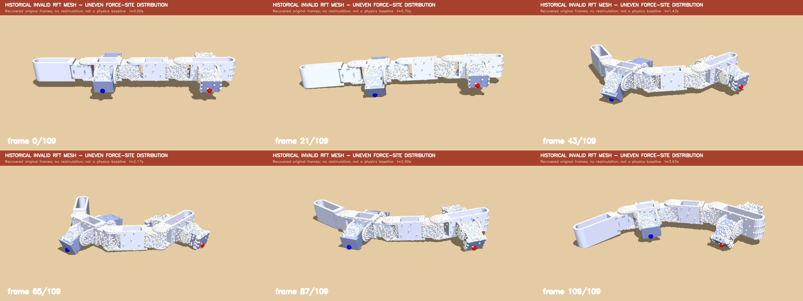

# Historical invalid-RFT locomotion

This is the earlier whole-lizard locomotion recording with the visibly
uneven RFT force-site distribution. It is the historical video that was
missing from the rejected-mesh comparison set.

[](legacy_incorrect_rft_locomotion_zoomed.mp4)

## Videos

- [Zoomed and labelled MP4 — recommended](legacy_incorrect_rft_locomotion_zoomed.mp4):
  follows the robot and enlarges the original image so the clustered points
  and gaps are easy to see.
- [Recovered full-frame MP4](legacy_incorrect_rft_locomotion_recovered.mp4):
  preserves the original 1280×720 camera framing.
- [Six-frame contact sheet](legacy_incorrect_rft_locomotion_contact_sheet.png).
- [Machine-readable recovery manifest](manifest.json).

The white spheres are the historical triangle/RFT force sites. Visible
symptoms include dense clusters around limb/body junctions, sparse panels,
and abrupt density changes between adjacent surfaces.

## Why recovery was required

The archived `legacy_sand.mp4` recording was interrupted before the MP4
`moov` index atom was written. Its image payload still contained:

- 111 complete H.264 NAL units;
- 110 decodable video frames;
- 9,400 trailing bytes from one incomplete unit.

The recovery restored matching same-batch SPS/PPS headers, discarded only the
incomplete tail, and losslessly encoded the 110 decoded historical frames into
a valid MP4. It did not rerun MuJoCo, recompute RFT, interpolate motion, or
invent missing frames.

## Production provenance

- source implementation commit:
  `e238a80b0fa54d1021cd9ff29af42d15abb9000d`;
- source worktree: clean;
- command:

```bash
python scripts/recover_legacy_rft_video.py \
  --output-dir outputs/legacy_rft_locomotion/production_e238a80
```

- both MP4 files: 110 frames, 30 FPS, 3.667 seconds, 1280×720,
  H.264/yuv420p;
- zoom crop: 736×414, resized to 1280×720 and explicitly labelled;
- source, header, recovery structure, artifacts, and hashes:
  [`manifest.json`](manifest.json).
- the tracked manifest is content-identical to the raw output with LF line
  endings normalized by Git.

## Integrity

| File | Bytes | SHA-256 |
| --- | ---: | --- |
| `legacy_incorrect_rft_locomotion_recovered.mp4` | 3,193,980 | `A2CE3648E185D14F02C07EBA9683F8DCAB300B800080B7CC6C3B827C1FDD8682` |
| `legacy_incorrect_rft_locomotion_zoomed.mp4` | 2,652,376 | `C380F225DF0B8C746782C45B64198B448E11100D5424070265982A9B45868E2F` |
| `legacy_incorrect_rft_locomotion_contact_sheet.png` | 474,779 | `CCDC29FD6684422B0795ACA9F479D8C23AEFC124F86D2308831C6AD7BF6B2AEB` |
| `manifest.json` | 2,589 | `6090D0C008386F7A9595D63BABF27FDD623579A49D31C4B0AED5031434B1039C` |

## Scientific boundary

This video is visual failure evidence only. The old mesh was known to have
invalid topology and an uneven triangulation, and the exact historical
integration state is not an accepted baseline. Do not use apparent motion,
penetration, displacement, contact timing, or force-site behavior here as a
physics, gait, or performance result.
