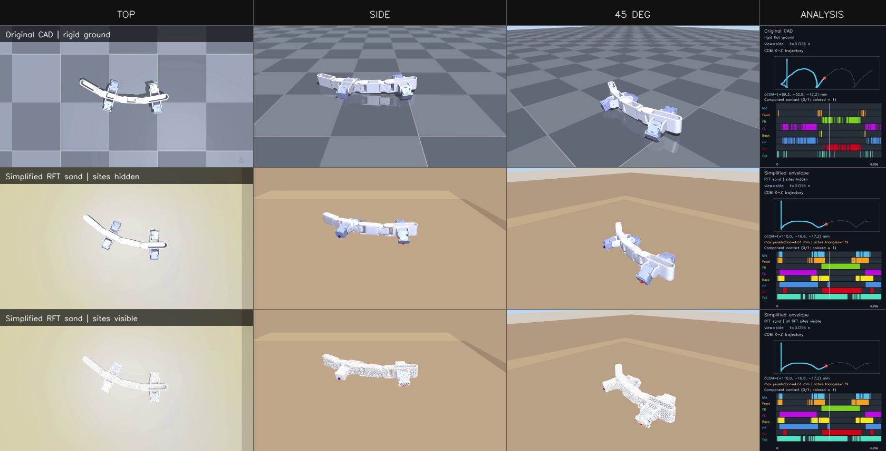

# Production 6 s video matrix and master overview

Date: 2026-07-27

## Source and command

- Source commit: `ff1dda2f954dc27e7d01499f5200497ad30c91f7`
- Generator-recorded dirty state: `false`
- Local raw directory:
  `outputs/video_matrix/production_6s_main_ff1dda2/`

```powershell
python scripts/generate_video_matrix.py `
  --duration 6 --fps 30 `
  --output-dir outputs\video_matrix\production_6s_main_ff1dda2

python scripts/analyze_video_matrix.py `
  outputs\video_matrix\production_6s_main_ff1dda2
```

## Acceptance

- nine synchronized individual MP4 files;
- one master overview MP4;
- overview layout: three scenario rows × `Top | Side | 45° | Analysis`;
- overview: 181 frames, 30 FPS, 6.033 s, 1680×858;
- all generator-manifest artifact hashes verified by the analyzer;
- COM, contact events/duty, penetration, and active-triangle metrics extracted;
- representative middle frame visually inspected;
- 11/11 fast tests and the full fast project validator passed.

Master video:

- path:
  `videos/video_matrix_overview.mp4`
- bytes: `4,539,623`
- SHA-256:
  `7341225A5E79EA6FB34A1CDF0D02F22F914C727D0A9D7DAC779EC61BBA6BDB90`

## Observed 6 s numerical results

- rigid COM displacement:
  `(+0.2043, +0.0242, -0.0071) m`;
- rigid COM path length: `0.3127 m`;
- RFT COM displacement:
  `(+0.2231, -0.1044, -0.0151) m`;
- RFT COM path length: `0.3132 m`.

These are numerical regression/reporting results, not experimentally
calibrated locomotion claims.

## Tracked compact evidence

| File | Bytes | SHA-256 |
| --- | ---: | --- |
| `component_metrics.csv` | 2,306 | `6AF10FF5B10AFD1C52FB6664938EA7D2A650D76C41DEE85BBB30D33A477D39C9` |
| `contact_events.csv` | 243,678 | `07C3293B93C3CA4830BED908FC44864398A64B235B382CF4E35DC3D537AFEC8B` |
| `derived_metrics.json` | 7,726 | `2AA24EC1AED97102E3B6C7FCF5085D25B32B53D36A1073EA00D2433884B42351` |
| `matrix_manifest.json` | 6,499 | `2355223FE9DE1180E66823B362DACF72AC805DF0F67056583F1F0A2B492575C4` |
| `rigid_original_contact_diagram.png` | 143,489 | `DD84CA56F09BBE08A1E13A3D3B8C3E4C53E342FB6EEE48507445980C0AE7308D` |
| `sand_rft_contact_diagram.png` | 103,583 | `4CD86AD3C6B22BBC19FC4DC3D153EBD9BA646C21F356C76623EFA0471CB0D176` |
| `video_matrix_overview_mid.png` | 429,591 | `09AEAD4C8B1E7E37A375C2F944D5409AF678BE0A00DDB93702070DB334697CE2` |

## Representative middle frame



The full video hashes and all other generated artifact hashes are recorded in
`matrix_manifest.json`.
