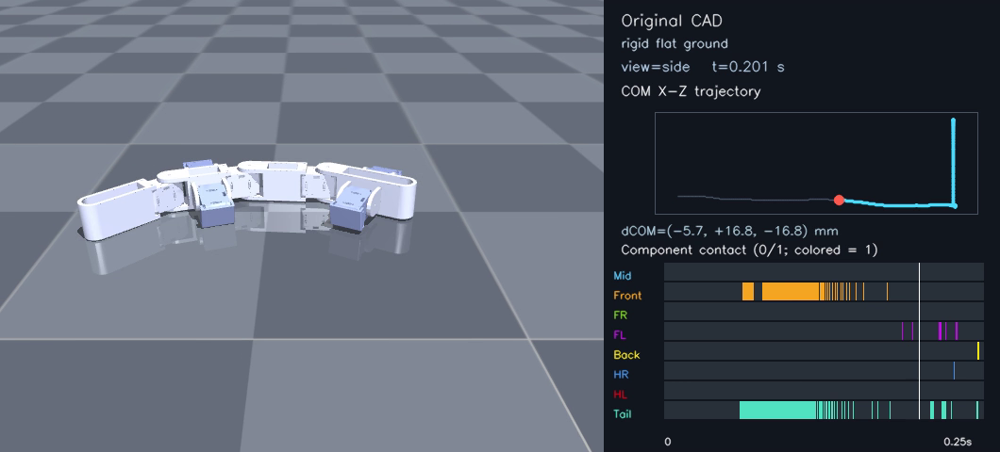
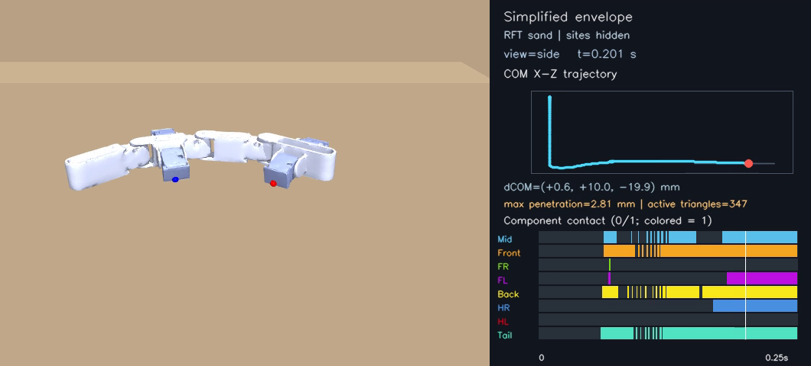
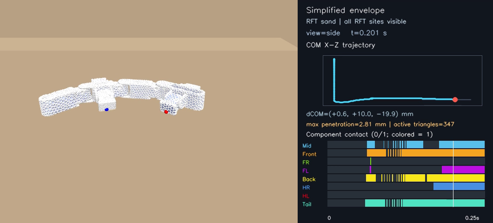
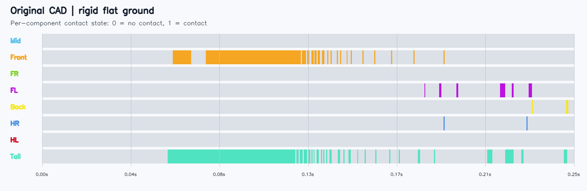
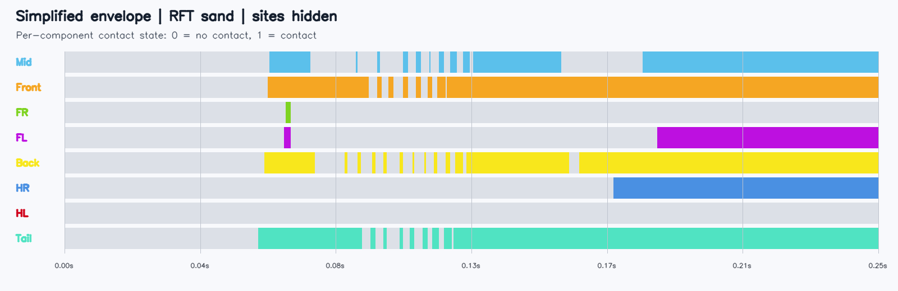

# Video-matrix clean smoke

Date: 2026-07-27

## Source

- Implementation commit:
  `ef27d2bfb82f2752ef341810aaf6300d9a094b0e`
- Git dirty state recorded by generator: `false`
- Local raw directory:
  `outputs/video_matrix/release_smoke_ef27d2b`
- Duration: 0.25 s
- FPS: 10
- Main render: 640×480
- Analysis panel: 420 px

Command:

```powershell
python scripts/generate_video_matrix.py `
  --duration 0.25 --fps 10 `
  --width 640 --height 480 --panel-width 420 `
  --output-dir outputs\video_matrix\release_smoke_ef27d2b
```

Analysis:

```powershell
python scripts/analyze_video_matrix.py `
  outputs\video_matrix\release_smoke_ef27d2b
```

## Acceptance

- nine MP4 files generated;
- top, side, and 45-degree views generated for all three scenarios;
- visible-site sand videos show all RFT sites;
- hidden-site sand videos use the identical sand state replay;
- COM trail/current marker/displacement rendered;
- penetration and active-triangle overlay rendered;
- all eight contact rows rendered as continuous 0/1 states;
- manifest hash/size verification passed;
- derived JSON and component CSV generated.

This is a renderer/data-pipeline smoke, not a locomotion-performance result.
The first 0.25 s includes settling transients.

## Video hashes

| Video | Bytes | SHA-256 |
| --- | ---: | --- |
| `rigid_original/top.mp4` | 62,472 | `67F391E96794B7DDFE974018D3994D9ADB914243714911BDA640C7CC5818BDF7` |
| `rigid_original/side.mp4` | 73,987 | `20FE4F2D790A4CE439912A1F0267C548A09869D4201343E0F2CF85FC28FB4442` |
| `rigid_original/diag45.mp4` | 106,989 | `1DEB6A41186A84CF81E9254D26F11A3A05C67B0B89F3EFFA05C6C87DB79462C3` |
| `sand_simplified/top.mp4` | 87,731 | `20E053B75835EB7C85C21E1CB244643E6826744559C33FBFCFF147F49763CACF` |
| `sand_simplified/side.mp4` | 60,336 | `153EAA10B9ABCE576B5AFDA0D0D8668F936F12765DBCB9B78EDE9B99117BB388` |
| `sand_simplified/diag45.mp4` | 76,923 | `0E138014336326D3159E97FB2879380DF5969CD57ADD17690CE470923B811031` |
| `sand_simplified_sites/top.mp4` | 99,650 | `A448BCF6519F78ABB4C770D9C53DFE35F264C5EF5DED05D8C37468881C052273` |
| `sand_simplified_sites/side.mp4` | 82,985 | `8036F9DA199104E69E819934075F34BED6A469997771B70E0BD0C3393E6E9FC1` |
| `sand_simplified_sites/diag45.mp4` | 104,170 | `9B8090A84796C176E11ECC7C77101CA06E99F3F80D0EFC8047DF528455E57D04` |

## Tracked compact evidence

| File | SHA-256 |
| --- | --- |
| `matrix_manifest.json` | `479952A1AFC383A2A90EC129B50705AC0F2B7DDD0010EE132D5C42F859AD7045` |
| `derived_metrics.json` | `1A8BEABD8455170790D84B433F8749D1D4118B559A5C89D2B29DE5D40A8F91CF` |
| `component_metrics.csv` | `666EB8348476D6CE73B0ECEBCFD9333E4DEF17BAB8CBC1CEDC2FD3456D983608` |
| `contact_events.csv` | `43001EC7ABDD42F8ABBDC8C55417157DCF35040FD922DF46DCEC60724311DA04` |
| `rigid_original_contact_diagram.png` | `F0B63C2E42E5C8649CA6F3FCC93F59080287FA9BA0F6B51720EB0D65E6146F9E` |
| `sand_rft_contact_diagram.png` | `3267EC1861549616A645FE89D3852E6A43E0B93E51AF86B540E2430FCBC2BE73` |
| `rigid_original_side.png` | `5535378F9DB3CEBA17BDE8B2B328BDCC238BD88A365E92DDA0DCCE28FEEEEF30` |
| `sand_simplified_side.png` | `4AAE0E0E0933993D56913533FFE697F86D3B6F2DD2DD144E3B1623F942D34F3E` |
| `sand_simplified_sites_side.png` | `941A8FE1F6CD1B7B1C89547253185ABCB5756FD0148FA72955F18E2E813EFA1D` |

The full machine-readable artifact inventory is in `matrix_manifest.json`.

## Representative frames

### Original detailed CAD, rigid floor



### Simplified RFT sand, sites hidden



### Simplified RFT sand, sites visible



## Contact diagrams




